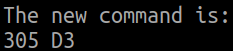
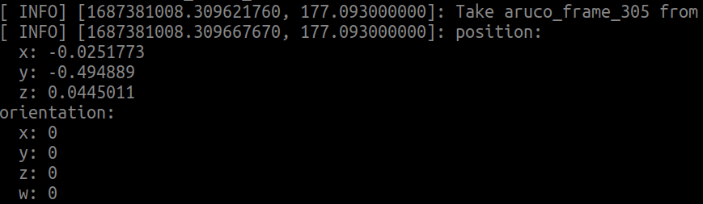
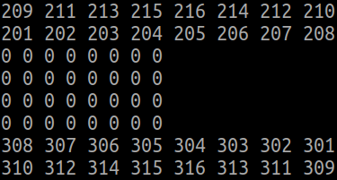
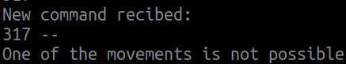
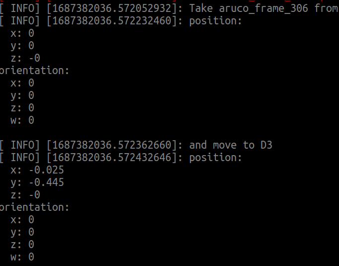
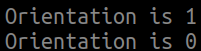
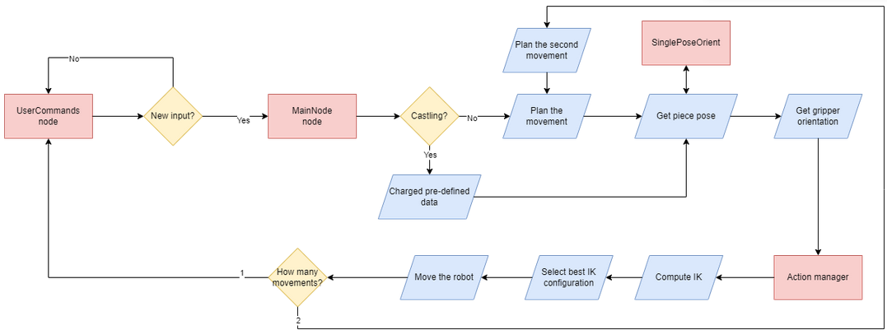

# Final work 
Team 05: 
*	Lluis Prior 
*	Marina Pujol
*	Usama Hamayun

## Intro

The current document collects the solution proposed by the team to reproduce a chess match where the robot moves the pieces according to the user commands. 

## Contents

*   [Assumptions](#assumptions)
*   [Install](#install)
*   [Usage](#usage)
*   [WorkFlow](#workflow)

## Assumptions

*   The robot does not check if the movement required by the user is legal or not, it just reproduces what it's asked to do.For instance we assume that the user know the logic of the game and knows the legal movement of each piece.

### Install

*	[ ] Create a git repository folder.
*	[ ] Clone the necessary packages.
```
git clone  --recurse-submodules https://gitioc.upc.edu/rostutorials/ros2223-final-project.git
git clone https://gitlab.com/intro2ros/2023/team05/FINAL-WORK/chesslab_setup.git
```
*	[ ] Create a catkin folder.
*	[ ] Link the packages to the catkin folder.
```
ln -s ~/git-projects/ros2223-final-project/
ln -s ~/git-projects/final-work/chesslab_setup/
```
*	[ ] In the catkin folder, build the program.
```
catkin build
```
*	[ ] Launch the scenario.
```
roslaunch chesslab_setup simulated_scenario.launch
```
*	[ ] Start the simulation in the gazebo. This step can be change with an argument when the launch is executed in the past step.
*	[ ] Wait a few seconds until all the elements start working properly. 

### Usage

Up untill now, the packages are installed and the simulation is running. Now, the user can introduce a new command using a terminal service. To input a command, it would introduce the piece name and the destination location as a string. The pieces are called based on the type of piece, the color and a number in case there are more than 1.
To define the piece type, the input may vary between:
*	”P”, used to define pawns.
*	“B”, used to define bishops.
*	“K”, used to define knights.
*	“R”, used to define rooks.
To define the color of the team, the input may vary between:
*	“B”, for black team.
*	“W”, for white team.
To define the number of the piece, just introduce a number.

The input of data is done calling the service “userCommands” and as argument the command.
```
rosservice call /chesslab_setup/userCommands
```

For example, to move the first black bishop to A3, the input must be "BB1 A3".
```
rosservice call /chesslab_setup/userCommands "BB1 A3"
```

The kings and queens have special commands to be called. Those are KK + color for the kings and QQ + color for the queens.
For example, to move the black king to B3, the input must be "KKB B3".
```
rosservice call /chesslab_setup/userCommands "KKB B3"
```

The program includes a function to do the castling. These commands are K + color + direction, where direction is "S" for short and "L" for long. Since the castling is a close movement, it does not need a destination so the values must be filled with “--”.

For example, for a long castling in black the input must be "KBL --".
```
rosservice call /chesslab_setup/userCommands "KBL --"
```

### WorkFlow

*	**Acquisition module**: This is the first step of the package. The whole module lies on the userCommands node. The first step is done by the user, who introduces a command through a service to the userCommand node. It consist in a service server that reads a 5 characters string that is stored. This module takes that command and transforms it to actual information the rest of the nodes can use. For example the name of the piece is transformed to a number identifier that the perception module can use or the castling cases are treated with special orders. 

	

	This new command is published to a topic to the remaining nodes.  Using a unordened map, the input name is transformed to a value. The whole message is prepare to be published under the "chesslab_setup/commands" topic. The callback function uses a flag that enables or disables or disables the publishing action, that avoids publishing the message more than one time. If the message is sent more than one time, the mainNode will reproduce the movement is a loop, failing in the process. 

*	**Perception module**: It is in charge of getting the position of the pieces. This function is developed using the service provided by the node “singlePoseOrient”. This node advertises a service called “getpiecepose” that, when given 2 id’s, returns the tf from one frame to the other. Usually one of the id's is the base of the robot. It helps the future modules to compute in a more direct way how to pick and place a piece.

	

*	**Planning module**: It works as the main node of the system. It stores a matrix with the current position of the pieces since the start of the game. Each value of the matrix corresponds to the piece id or a 0 if the place is empty. 

	

	The mainNode starts by receiving the message from the userCommands node, calling the corresponding callback function "messageReceived". The function divides the recibed message between the ID requested by the the user and the target position. Also it checks the type of movement the robot will realize. The movements may be classified between normal and castling. Since the castling movement is fixed, the algorithm contains a serie of pre-defined values that will be charged in this step, differentiating between the color and the length (long or short) of the castling. The castling movements will only be possible if the surrounding pieces are not pressent. 

	

	Depending on the type of movement, a flag is enable so the movements are called in correct order in the main loop. The main loop consist in a first verification of the pieces positions using the matrix. With this verification we can define if the final position is occupaid with another piece or if its free. With this verification done, depending on the flag, some different functions are called to obtain the necessary information before sending them to the action manager. The first function called is the "computeInformation". Using this information we can obtain the position(using the service getpiecepose) of the piece stored in the variable IDstring. Depending on the case, the value of the string may vary. For example for a castling case, the varible is overwritten by the corresponding pre-defined value. The position of the piece is stored in the variable init1. In this function, a second function is called named "chessToPose". This second function returns the position in x, y, z, Ox, Oy, Oz, Ow of the target position with respect to the base of the robot. This functions transforms the position of each requested ID to numbers, and by knowing the size of the squares of the board, and by adding the offsets to the robot. In the case where the movement is to the trash, the final values are overwritten for the trash position, that always is the same.

	

	The second step is to call the function "gripPose", which returns a boolean on true or false depending on the orientation the gripper should be. It takes the row and column indeces of the posiiton and check the top, bottom, left and right positions in the chessboard. Comparing which pieces are in the surroundings, we can decide the best orientation. The algorithms considers the best position as the direction of the lowest number of small pieces. In case of having the same number in both directions, it also takes into account the quantity of medium pieces. In the extrem cases, it also check the big pieces. 

  	

	With all this information we can call the action manager to move the robot. 

*	**Action manager**: This module takes the information of the planning module and executes the necessary movements to pick and place the correct pieces. It requires the initial position where to pick the piece, the final position to place the piece, and the orientation of the gripper in both positions. With this data, the first step is to look for a pose on top of the initial position. Now, a rectilinear movement is computed from the actual pose to the robot position. To create the movement, 10 little steps are prepared. The more steps the more perfectly linear the movement will be. Now, the inverse kinematics  of all those points is calculated. For a 6 dof manipulator, the inverse kinematics may obtain 8 different possible configurations.  To select one of them, there exist 4 conditions that the configuration must fullfil.

	*	The configuration of the joint 0 must be between [0, pi]. This conditions ensures that the robot shoulder is at the right.
	*	The configuration of the joint 1 must be between [-0.5, -pi+0.5]. This ensures that the arm will not colide with the black pieces, that are placed just in front of the robot.
	*	The values of the joints 2 and 4 must be of different sign. This ensures that the elbow is pointing to the sky.

	The final set of configurations is sent to the robot.


The final workflow of the program can be seen in the next figure

[](https://www.youtube.com/watch?v=0GHr0PB0Luc)

 

Two demonstration videos can be found in the ReadmeImages folder.
